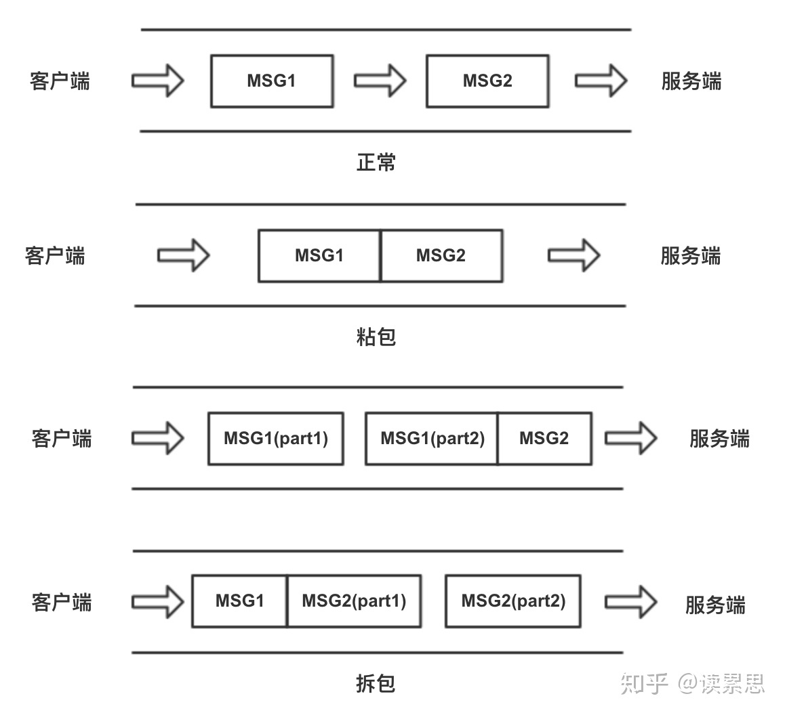

本文主要内容来自![]https://zhuanlan.zhihu.com/p/77275039

# TCP中的沾包与拆包

在TCP连接中，信息是在管道中流通的，可能会出现两种情况：

* 输入的信息大于管道的流通速度，导致多个tcp出现粘连，另一端在获取信息时一次取到多个或者不完整的tcp包，这种情况被称为沾包。
* 输入的信息小于管道的流通输入，导致不完整的tcp包被另一端取走，这种情况被称为拆包。

各种情况如下图所示。



如果发现沾包或者拆包，服务器接收到的是冗余或者缺损的信息。为了解决这个问题，我们可以直接中netty提供的接口来重服务器还原正确的信息，也可以自己实现该功能。具体就是在每一个信息前加上一个length，表示这个信息的完整长度，即使出现了沾包或者拆包，我们也可以使用length变量正确地还原出一个tcp包的信息。


客户端代码如下：

```
import java.io.OutputStream;
import java.net.Socket;

public class SocketClient {

    public static void main(String[] args) throws Exception {
        // 要连接的服务端IP地址和端口
        String host = "127.0.0.1";
        int port = 55533;
        // 与服务端建立连接
        Socket socket = new Socket(host, port);
        // 建立连接后获得输出流
        OutputStream outputStream = socket.getOutputStream();
        String message = "这是一个整包!!!";
        byte[] contentBytes = message.getBytes("UTF-8");
        System.out.println("contentBytes.length = " + contentBytes.length);
        int length = contentBytes.length;
        byte[] lengthBytes = Utils.int2Bytes(length);
        byte[] resultBytes = new byte[4 + length];
        // 将tcp包的长度写入resultBytes数组中
        System.arraycopy(lengthBytes, 0, resultBytes, 0, lengthBytes.length);
        // 将tcp包的信息写入resultBytes数组中
        System.arraycopy(contentBytes, 0, resultBytes, 4, contentBytes.length);

        for (int i = 0; i < 10; i++) {
            outputStream.write(resultBytes);
        }
        Thread.sleep(20000);
        outputStream.close();
        socket.close();
    }
}
```


服务端的代码：

```
import java.io.InputStream;
import java.net.ServerSocket;
import java.net.Socket;

public class SocketServer {
    public static void main(String[] args) throws Exception {
        // 监听指定的端口
        int port = 55533;
        ServerSocket server = new ServerSocket(port);
        // server将一直等待连接的到来
        System.out.println("server将一直等待连接的到来");
        Socket socket = server.accept();
        // 建立好连接后，从socket中获取输入流，并建立缓冲区进行读取
        InputStream inputStream = socket.getInputStream();
        byte[] bytes = new byte[1024 * 128];
        int len;
        byte[] totalBytes = new byte[]{};
        int totalLength = 0;
        while ((len = inputStream.read(bytes)) != -1) {
            //1. 将读取的数据和上一次遗留的数据拼起来
            int tempLength = totalLength;
            totalLength = len + totalLength;
            byte[] tempBytes = totalBytes;
            totalBytes = new byte[totalLength];
            System.arraycopy(tempBytes, 0, totalBytes, 0, tempLength);
            System.arraycopy(bytes, 0, totalBytes, tempLength, len);

            while (totalLength > 4) {
                // 数据的前4位总是代表着写一个tcp包的长度
                byte[] lengthBytes = new byte[4];
                System.arraycopy(totalBytes, 0, lengthBytes, 0, lengthBytes.length);
                int contentLength = Utils.bytes2Int(lengthBytes);
                //2. 如果剩下数据小于数据头标的长度，则出现拆包，再次获取数据连接，接收下一个tcp包
                if (totalLength < contentLength + 4) {
                    break;
                }
                //3. 将数据头标的指定长度的数据取出则为应用数据
                byte[] contentBytes = new byte[contentLength];
                System.arraycopy(totalBytes, 4, contentBytes, 0, contentLength);
                //注意指定编码格式，发送方和接收方一定要统一，建议使用UTF-8
                String content = new String(contentBytes, "UTF-8");
                System.out.println("contentLength = " + contentLength + ", content: " + content);
                //4. 去掉已读取的数据
                totalLength -= (4 + contentLength);
                byte[] leftBytes = new byte[totalLength];
                //5. 将剩下的包的信息放入totalBytes数组中。
                System.arraycopy(totalBytes, 4 + contentLength, leftBytes, 0, totalLength);
                totalBytes = leftBytes;
            }
        }
        inputStream.close();
        socket.close();
        server.close();
    }
}
```

其中Utils代码如下:

```
public final class Utils {
    public static byte[] int2Bytes(int i) {
        byte[] result = new byte[4];
        result[0] = (byte) (i >> 24 & 0xFF);
        result[1] = (byte) (i >> 16 & 0xFF);
        result[2] = (byte) (i >> 8 & 0xFF);
        result[3] = (byte) (i & 0xFF);
        return result;
    }
    //字节数组转为int数值
    public static int bytes2Int(byte[] bytes){
        int num = bytes[3] & 0xFF;
        num |= ((bytes[2] << 8) & 0xFF00);
        num |= ((bytes[1] << 16) & 0xFF0000);
        num |= ((bytes[0] << 24)  & 0xFF000000);
        return num;
    }
}
```

